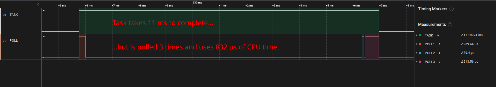

# [`embedded-trace`](https://github.com/jbeaurivage/embedded-trace)


A `Future` tracing utility for embedded systems.

This crate aims to provide tools to measure the execution time and debug
`async` tasks and `Future`s for `#![no_std]` projects.



# How to use this library

Two main traits are defined: `TraceFuture` and `Instrument`.

## `TraceFuture`
`TraceFuture` extends the standard library's `Future` trait by adding
the `trace_task`, `trace_poll` and `trace_task_and_poll` methods.
These methods each take one or more types implementing `Instrument`. The
three provided methods call `on_enter` and `on_exit` when entering the
specified spans, respectively. Consult the `TraceFuture` trait
documentation for more information.

## Instrument
Instrument represents the mechanism by which TraceFuture's methods
will signal when a span is entered or exited. You can implement this trait
on your own types. Some implementation for commonly used types are also
provided in the instruments module.

For instance, a simple mechanism may be to set a GPIO pin HIGH
when entering the span, and setting it LOW when exiting. This
instrumentation is provided in the instruments::gpio module. 

### Supported GPIO implementations:

* Types implementing `embedded-hal` version 1.0 `OutputPin`
* Types implementing `embedded-hal` version 0.2 `OutputPin` (by enabling the `embedded-hal_0_2` Cargo feature)

## Example use with GPIO instrumentation

```rust
use core::future::Future;
// `TraceFuture` must be in scope in order to use its methods.
use embedded_trace::{TraceFuture, Gpio, GpioRef};
use embedded_hal::digital::OutputPin;

async fn trace_my_future<F, P1, P2>(future: F, task_pin: P1, poll_pin: &mut P2)
where
    F: Future,
    P1: OutputPin,
    P2: OutputPin
{
    // `Gpio` can be used where we can take the pin...
    let mut task_instrument = Gpio::new(task_pin);
    // ...or `GpioRef` when all we have is a mutable reference to a pin.
    let mut poll_instrument = GpioRef::new(poll_pin);

    // Poll our future while tracing its execution.
    future.trace_task_and_poll(&mut task_instrument, &mut poll_instrument).await;

    // We can reclaim the pin taken by `Gpio`
    let task_pin = task_instrument.free();
}
```

